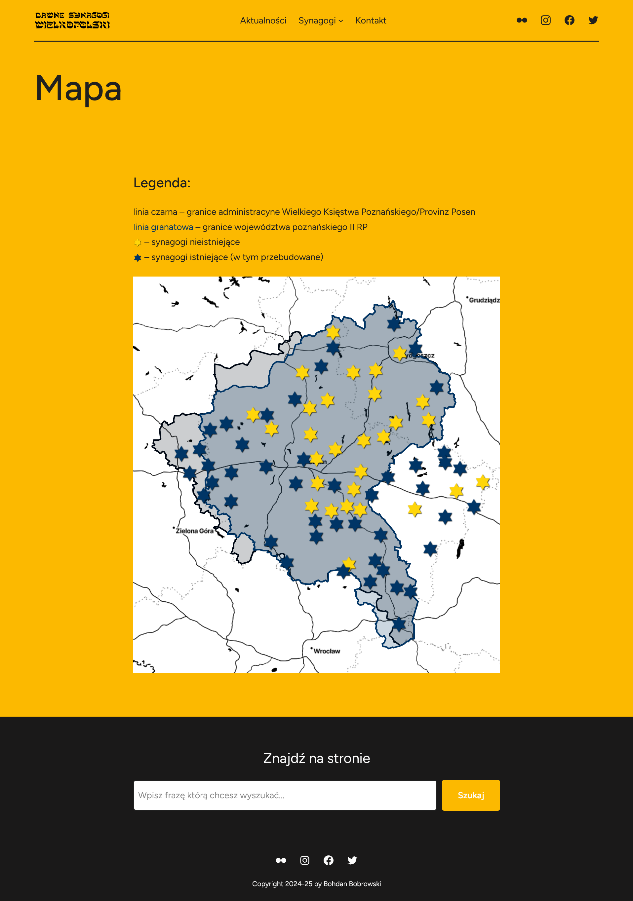
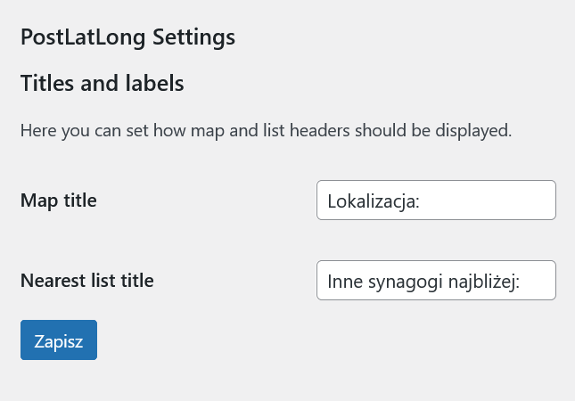
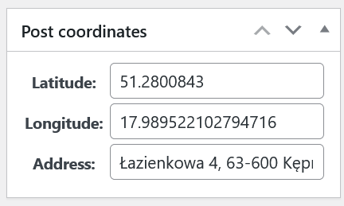
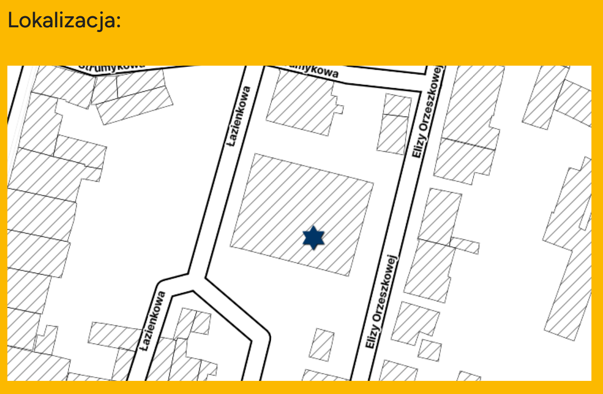
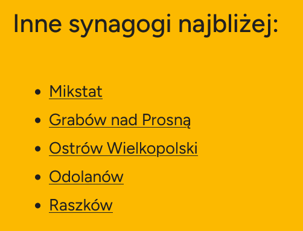

# PostLatLong

Simple wordpress plugin which:
- adds post meta fields for longitude, latitude and address (nothing is validated!),
- prints meta tags with **geo.position** and **geo.placename** (which is post title) in page header,
- draws a map with post position at the on of post content using [leaflet-map](https://github.com/bozdoz/wp-plugin-leaflet-map) plugin which is required btw,
- prints a list of (by default) 5 nearest posts from your blog.

This can be used for various purposes, but my intention was to create a plugin that would allow for publishing tourism-related content.

The motivation for creating this plugin was the lack of an available solution that would satisfy me (most WordPress plugins are scam) because I needed this feature for the website of my photography project "Former Synagogues of Greater Poland" ([synagogu.es](https://synagogu.es) - for now it's in Polish).

## Configuration

On settings page you can configure how labels will be displayed. If you leave it empty - headers will not be displayed.

## Editing post

## Using Wordpress API

If you're using API to write your posts just use metadata fields like in this python example:

    response = requests.post(
        f"{SITE_URL}/wp-json/wp/v2/posts",
        data={
            "title": "Title",
            "content": "Post content",
            "status": "publish",
            [...]
            "post_lat": 51.2800843,
            "post_long": 17,98522102794716,
            "post_address": "Address Example",
        },
        headers={},
    )

## Shortcodes

### Draw a map with post location

    [postlatlong-map]

This is handled with [leaflet-map](https://github.com/bozdoz/wp-plugin-leaflet-map), so this plugin must be installed and configured.

Example on [synagogu.es](https://synagogu.es/2025/09/07/kepno/):

### Show list of nearest posts

    [postlatlong-nearest]
    [postlatlong-nearest limit=10]

Example on [synagogu.es](https://synagogu.es/2025/09/07/kepno/) - list shows nearest synagogues to the one which is currently displayed:

